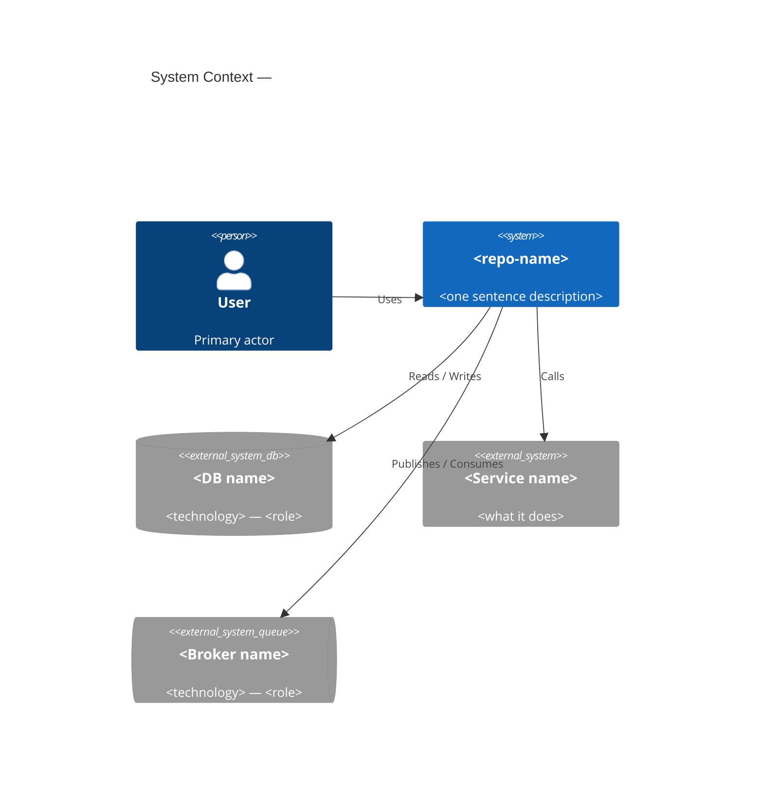

---
**Supervisor task override — Phase 5 only.**

Ignore the general workflow above. Your **sole task** this run is to identify
integration points and write **one artifact**: `architecture/c4-context.md`.
Stop as soon as the artifact is written.

---

## Phase 5 — C4 System Context Diagram

### Orientation context

The orientation summary and prior phase artifacts are injected below.
Do NOT repeat `get_architecture_summary`.

### Tool strategy

Goal: identify every external system the repo integrates with — databases,
message brokers, third-party APIs, external services.

**Step 1 — call `get_external_dependencies`** to see all external packages/types
referenced. Look for driver/client/SDK package names that reveal integration targets.

**Step 2 — call `execute_cypher`** to find integration-pattern class names:

```cypher
MATCH (n) WHERE n.name =~ '(?i).*(Client|Producer|Consumer|Gateway|Adapter|Sender|Publisher|Subscriber|Driver|Connector|DataSource|Queue|Cache|Storage|Broker|Stub|Proxy).*'
RETURN label(n) AS type, n.name AS name, n.package AS package
ORDER BY name LIMIT 60
```

**Step 3 — optionally call `get_api_endpoints`** to confirm what interfaces the
system exposes to its callers.

Do NOT call more than 3 tools total. Infer external system identities from
class names, package names, and import paths — you do not need source code.

### Identifying integration points

Classify what you find into C4 node types:

| Evidence in graph | C4 node type | Example |
|---|---|---|
| JDBC, JPA, Hibernate, SQLAlchemy, psycopg2, mongoose, pg | `SystemDb_Ext` | PostgreSQL, MySQL, MongoDB |
| Redis, Memcached, Caffeine client | `SystemDb_Ext` | Redis Cache |
| S3Client, GCSClient, BlobStorage | `SystemDb_Ext` | AWS S3, GCS |
| KafkaProducer/Consumer, RabbitMQ, SQS, AMQP | `SystemQueue_Ext` | Kafka, RabbitMQ |
| RestTemplate, WebClient, axios, requests, HttpClient | `System_Ext` | HTTP API (name from URL patterns or config) |
| AWS SDK (non-S3), Google APIs, Stripe, Twilio, SendGrid | `System_Ext` | Stripe, SendGrid |
| gRPC stub, Thrift client | `System_Ext` | Internal gRPC service |
| SMTP, JavaMail, nodemailer | `System_Ext` | Email Service |

### Write: `architecture/c4-context.md`

The artifact must contain:

1. **One paragraph** naming the system and listing its integration points with brief evidence.

2. **A Mermaid C4Context diagram** — use this exact fence:

````markdown

````

**Rules:**
- Include **only** external systems evidenced in the graph. Omit speculation.
- Mark inferred nodes with `' [Inferred]` comment on the line above.
- If you cannot identify the specific DB/broker/service name, use a generic label like `"Relational DB"` or `"HTTP API"`.
- Keep node labels ≤ 4 words.
- Omit node types with no evidence (e.g., no `SystemQueue_Ext` if no queue client found).
- The `System` node (the repo itself) must always be present.
- Total artifact length: under 80 lines.

Add this cross-reference line at the end:
`_(Integration detail: see architecture/system-overview.md → External Systems)_`
