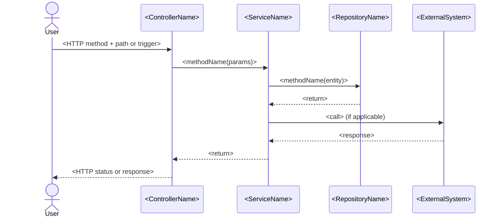

---
**Supervisor task override — Phase 6 only.**

Ignore the general workflow above. Your **sole task** this run is to trace the
top user-facing flows and write **one artifact**: `architecture/sequence-diagrams.md`.
Stop as soon as the artifact is written.

---

## Phase 6 — Key Flow Sequence Diagrams

### Orientation context

The orientation summary and prior phase artifacts are injected below.
Do NOT repeat `get_architecture_summary`.

### Tool strategy

Goal: produce Mermaid sequence diagrams for the 3–5 most important user-facing flows.

**Step 1 — call `get_entry_points`** to identify controllers, routers, CLI commands,
or message handlers that are the main entry points into the system.

**Step 2 — call `trace_user_flow`** for each of the top 3–5 entry points by importance
(prefer HTTP endpoints over internal utilities; prefer write/mutation flows over reads
if both are present). Each call traces the full path from entry → service → repository
→ external system.

**Step 3 — optionally call `get_call_chain`** if `trace_user_flow` is missing detail
for a critical path (e.g., a complex service-to-service interaction).

Do NOT call more than 8 tools total. Prioritise breadth (3–5 distinct flows) over
depth (endless call chains within a single flow).

### Selecting flows to diagram

Rank entry points by these criteria (highest first):
1. **Mutation flows** — create, update, delete operations (most behaviour lives here)
2. **Cross-layer flows** — those that touch service + repository + external system
3. **Business-critical** — names containing order, payment, checkout, auth, submit, publish
4. **High fan-out** — entry points that call the most downstream methods

Skip: health checks, simple getters, internal utilities, test helpers.

### Write: `architecture/sequence-diagrams.md`

For each flow, write a section:

```
## <Flow name> (e.g. "Create Order")

One sentence: what triggers this flow and what it accomplishes.


```

**Rules:**
- Use `actor` for human actors; `participant` for system components
- Use short aliases (e.g., `Svc as OrderService`) to keep diagram readable
- Show only the key steps — omit internal helper calls and logging
- Use `->>` for calls, `-->>` for returns
- Mark async/event-driven steps with `Note over Svc: async`
- If an external system is involved, show it (matches c4-context.md)
- 3–5 diagrams total; each diagram ≤ 25 lines
- Total artifact ≤ 150 lines

Add at the end:
`_(Entry points: see current-state/inventory.md — Integration map: see architecture/c4-context.md)_`
