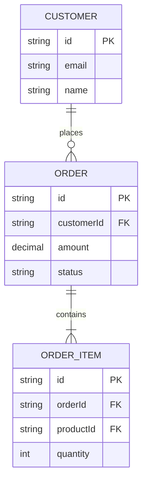

---
**Supervisor task override — Phase 7 only.**

Ignore the general workflow above. Your **sole task** this run is to map the
data model and write **one artifact**: `domain/er-diagram.md`.
Stop as soon as the artifact is written.

---

## Phase 7 — Entity Relationship Diagram

### Orientation context

The orientation summary and prior phase artifacts are injected below.
Do NOT repeat `get_architecture_summary`.

### Tool strategy

Goal: produce a Mermaid ER diagram and annotate entity ownership by bounded context.

**Step 1 — call `get_domain_model`** to retrieve all entity classes, their fields,
and relationships (associations, compositions, foreign keys).

**Step 2 — optionally call `get_class_hierarchy`** on the most important base entity
if there is an inheritance hierarchy worth showing (e.g., a `BaseEntity` or `AuditableEntity`).

**Step 3 — optionally call `execute_cypher`** to find join/bridge tables or
value objects that `get_domain_model` may have missed:

```cypher
MATCH (n) WHERE label(n) IN ['Class', 'Interface']
  AND (n.name =~ '(?i).*(Entity|Model|Record|Table|Aggregate|ValueObject|VO|Dto|Document).*'
    OR n.annotations =~ '(?i).*(Entity|Document|Table|MappedSuperclass).*')
RETURN n.name AS name, n.package AS package
ORDER BY name LIMIT 50
```

Do NOT call more than 3 tools total.

### Write: `domain/er-diagram.md`

The artifact must contain:

1. **One paragraph** summarising the data model: number of entities, dominant
   relationship pattern (hierarchical, graph, flat), and any notable design choices
   (e.g., soft deletes, audit fields, polymorphic associations).

2. **A Mermaid erDiagram** showing entities, key fields, and relationships:

````markdown

````

3. **A Bounded Context ownership table** (cross-reference to domain-analysis.md):

| Entity | Bounded Context | Notes |
|--------|----------------|-------|
| Order, OrderItem | Order Management | aggregate root: Order |
| Customer | Customer | owns identity data |

**Rules:**
- Show only persistent entities (skip DTOs, request/response objects, pure value objects)
- Include PK, FK, and 2–4 most important domain fields per entity; omit audit/timestamp fields
- Use ALL_CAPS for entity names in the diagram (Mermaid erDiagram convention)
- Relationship cardinality notation: `||--||` one-to-one, `||--o{` one-to-many, `}o--o{` many-to-many
- If the model is large (> 15 entities), show only the core aggregate roots and their direct associations; note omissions
- Total artifact ≤ 120 lines

Add at the end:
`_(Bounded contexts: see domain/domain-analysis.md — Tech stack: see current-state/inventory.md)_`
